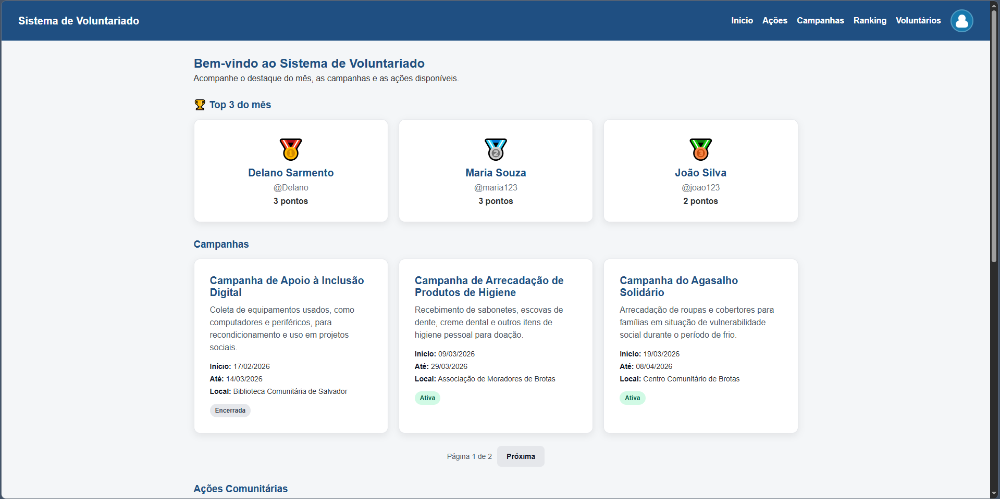
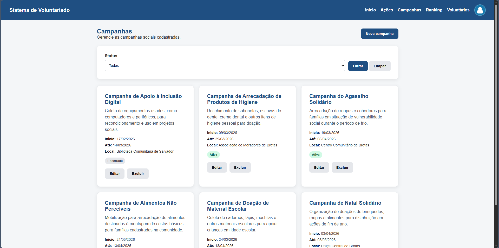
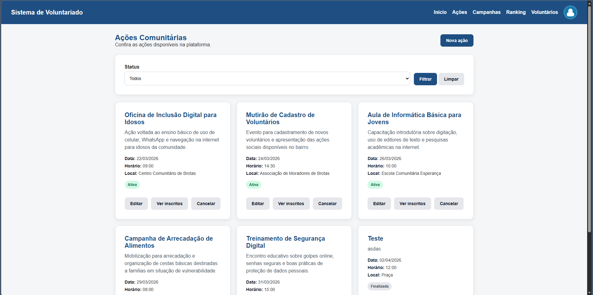
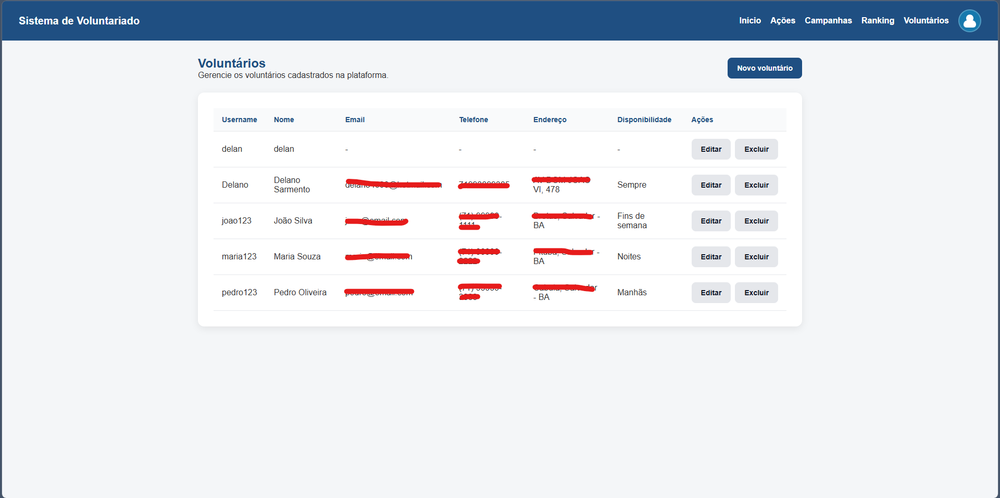
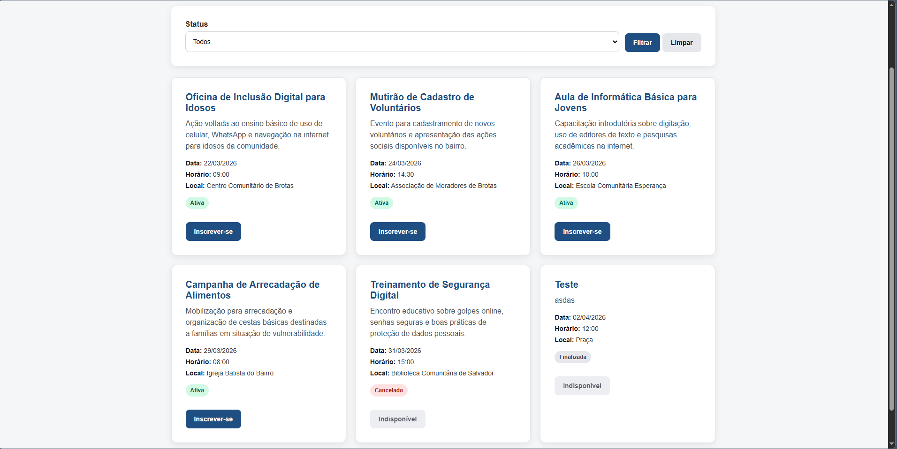

# Sistema de Gestão de Voluntariado Comunitário

##  Sobre o Projeto

O Sistema de Gestão de Voluntariado Comunitário é uma plataforma web desenvolvida com o objetivo de auxiliar organizações sociais, como igrejas e projetos comunitários, na organização de campanhas, ações sociais e gerenciamento de voluntários.

A aplicação permite centralizar informações, facilitar o cadastro de participantes e otimizar o planejamento de atividades sociais, promovendo maior eficiência na execução de ações comunitárias.

O sistema foi aplicado na **Igreja Batista Comunidade Esperança – Salvador/BA**, como parte de um projeto extensionista voltado à inclusão digital e apoio a iniciativas sociais.

---

##  Funcionalidades

- Cadastro e autenticação de usuários  
- Criação e gerenciamento de campanhas  
- Criação e gerenciamento de ações sociais  
- Inscrição de voluntários em ações  
- Ranking dos voluntários  
- Listagem com filtros e paginação  
- Interface simples e intuitiva  

---

##  Tecnologias Utilizadas

- **Python**
- **Django**
- **Django REST Framework**
- **PostgreSQL**
- **HTML**
- **CSS**
- **JavaScript**

---

##  Demonstração da Plataforma

###  Tela Inicial

Página principal com listagem de campanhas e ações disponíveis.

---

###  Cadastro de Campanhas

Interface para criação e gerenciamento de campanhas sociais.

---

###  Cadastro de Ações

Tela para criação e gerenciamento de ações.

---

###  Voluntários

Gerenciamento de voluntários e inscrição em ações.

---

###  Inscrição em Ações

Processo de vinculação de voluntários às ações sociais.

---
